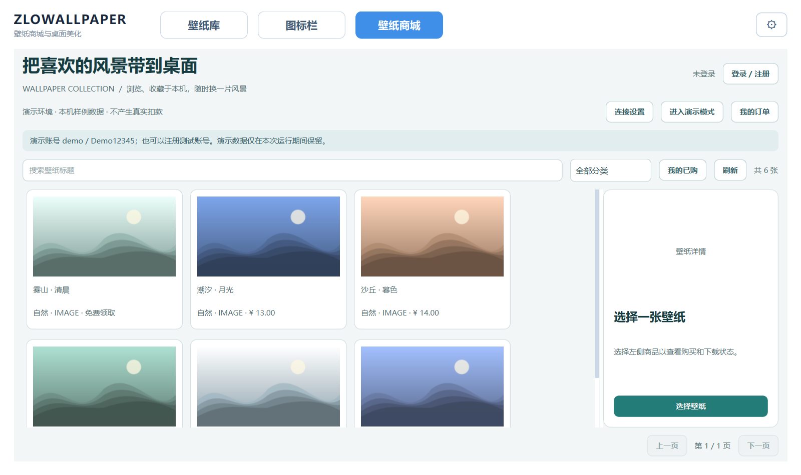

# ZloWallpaper 前端

独立的 Qt/C++ Windows 客户端。保留 Asterol 桌面美化功能，并新增壁纸商城。

- [前端开发、构建与运行](docs/FRONTEND.md)
- [后端需求和联调交接](docs/BACKEND-HANDOFF.md)
- [OpenAPI v1 契约](docs/openapi.yaml)
- [实际验证记录](docs/VALIDATION.md)
- [运行包来源及许可边界](docs/RUNTIME-NOTICES.md)

默认后端地址 `http://127.0.0.1:8080/api/v1`。后端尚未实现，可点击“进入演示模式”，或者使用 `--demo` 启动。演示账号 `demo` / `Demo12345`，付款只作测试，不扣款。

依赖运行包不提交 Git；准备依赖后执行 `scripts/Build.ps1`。勿把本地演示服务器当作生产后端。
